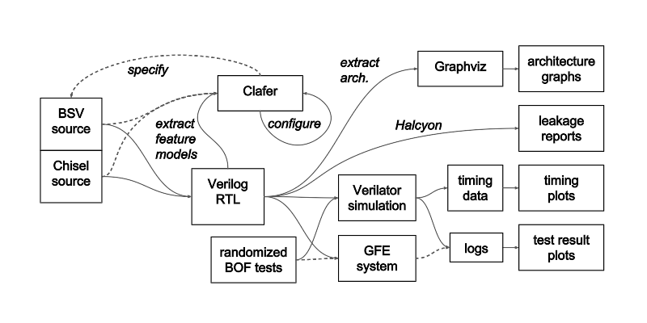
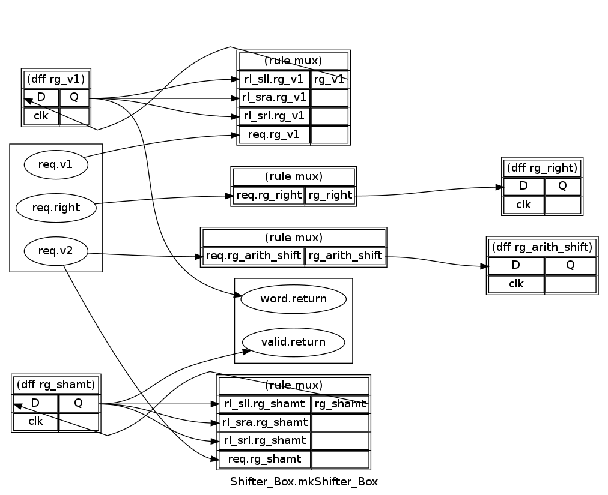

# The BESSPIN Tool Suite

This software allows users to configure SSITH processors
and measure their security features.
It is *prototype alpha software*, complete with bugs and missing features.
Support is provided for SSITH TA1 teams;
your feedback is valuable and will help shape ongoing development.
If you encounter trouble or would like to suggest improvements,
please file an issue here or on the specific tool's GitLab project,
visit the [SSITH Mattermost](https://mattermost.galois.com/darpassith/)
chat service, or contact ssith_ta1_support@galois.com.

Contents:
1. [Overview](#overview) of tool suite workflow
2. [Tutorial](#tutorial) example walkthrough
3. [Components](#components) listed and linked


## Overview

The diagram below roughly illustrates the intended flow of data and user interaction through the tool suite.
Dog-eared boxes indicate static artifacts, while rounded boxes show software components under development.
The stick figures show places where a user can interact with the system.
The development status of each component is listed in a table at the end of this section.



You, the user of the BESSPIN Tool Suite, bring a Chisel, BSV,
or System Verilog implementation of your secure processor design.
You also bring an informal model of the threats or software vulnerabilities
which your design should protect against.
You will be able to upload your design files through the web-based user interface,
where we automatically extract two separate models of your design.

The architecture model is a graphical abstraction used for visual reference and correlation.
At present, it simply visualizes the structure of your processor design.
As we develop analyses that focus on specific parts of the processor,
the architecture viewer will map test results onto the visualization.

The feature model represents the configuration space of your design:
all possible concrete, synthesizable instances of the elaborated design are points in this space.
Once a feature model has been extracted, you may configure it through the System Configurator view in the web UI.
A configured model, optionally supplemented with a customized build environment
that you will be able to upload, will be used to generate a 'Device Under Test' package.
Such a DUT package will include an FPGA bitstream or executable Verilator simulation
implementing your processor, along with your custom cross-compiler for test software
or a specific OS image, if needed.
This DUT will be run within a harness that provides an interface to both processor I/O and
observable internal state.

Meanwhile, with threat model in hand, you will be able to select
a formal model of a specific vulnerability of interest from
a library of such models, and configure it as appropriate.
This vulnerability model will in turn be used to construct a test package including
a generator for concrete test instances and
a classifier which decides the outcome of a single test instance run.
The configuration step will constrain the variation produced by the generator.
The test and DUT will run together within the harness, producing a stream of results
that are stored in an evidence database.
The dashboard view of the web UI will allow you to query and plot aggregated results.

| Component | Status |
| --------- | ------ |
| Feature model extractor | complete |
| System configurator | in progress |
| System builder | in progress |
| Architecture extractor | complete |
| Architecture viewer | prototype |
| Vulnerability configurator | prototype |
| Test instance generators | one prototype, more to come |
| Harness | in progress |
| Dashboard | first prototype, waiting for upstream data |


## Tutorial

This section is a walkthrough
demonstrating the main functionality of the BESSPIN tool suite.
More complete documentation is available for each of the [component projects](#components)
linked to in the following section.

All sections of this tutorial (with the exception of "Setup") are independent
and can be performed in any order.  In cases where one section depends on the
output of a previous section, a pregenerated copy of the output file is
included in the [`tutorial`](tutorial) subdirectory so that the later step can
be completed even if the first one fails or is skipped.


### Setup

While not all the component tools require an FPGA environment,
we assume that the tool suite is installed on a [GFE host](https://gitlab-ext.galois.com/ssith/gfe)
and has access to Vivado as well as the Bluespec compiler.

The Tool Suite requires the [Nix package manager](https://nixos.org/nix/).  To
install it, follow [these instructions](https://nixos.org/nix/manual/#sect-multi-user-installation).

**Binary cache setup (optional)**: We provide a Nix "binary cache" with
pre-built binaries of all tool suite packages.  Configuring Nix to use this
binary cache will avoid a lengthy compilation step on the first use of the tool
suite.  To use the binary cache, make the following changes to your Nix
configuration:

 * In `/etc/nix/nix.conf`, add these lines:

        trusted-public-keys = cache.nixos.org-1:6NCHdD59X431o0gWypbMrAURkbJ16ZPMQFGspcDShjY= besspin.galois.com-1:8IqXQ2FM1J5CuPD+KN9KK4z6WHve4KF3d9zGRK+zsBw=
        substituters = https://artifactory.galois.com/besspin_generic-nix/ https://cache.nixos.org/

 * We have distributed binary cache credentials to individual TA-1 teams by
   email.  Using the credentials for your team, create a file `/etc/nix/netrc`
   with the following contents:

        machine artifactory.galois.com
        login <your username>
        password <your password>

   This `netrc` file should be readable only by `root` (`0600` permissions)

 * Restart the Nix daemon:

        sudo systemctl restart nix-daemon.service


Once Nix is installed and configured, run `nix-shell` with this repository as your current
working directory.  Nix will download
and install the BESSPIN Tool Suite and its dependencies, and will open a shell
with all the commands available in `$PATH`.
The initial run of `nix-shell` may take several minutes to download the
necessary files, during which time it will not print progress information.
If you did not set up the binary cache as described above, the initial run must
also compile the tool suite packages from source, which takes several hours.
Subsequent runs will use locally cached packages,
and should start up within seconds.

All commands in the remainder of the tutorial should be run inside the
`nix-shell` session.


This tutorial uses the Piccolo processor as a running example,
and requires a copy of the Piccolo source code to be available alongside the
`tool-suite` directory.  The easiest way to set this up is to create a symbolic
link:

```sh
ln -s /path/to/gfe/bluespec-processors/P1/Piccolo ../Piccolo
```


### Architecture extraction and visualization

The BESSPIN architecture extraction tool analyzes a hardware design written in
BSV, Chisel, or SystemVerilog, extracts architectural information from the
design, and visualizes that information in various forms.

To visualize the structure of modules in the Piccolo processor, run these
commands:

```sh
# Generate graphs of modules in the design
besspin-arch-extract tutorial/piccolo.toml visualize
# Convert the graphs to PDF
for f in piccolo-arch/*.dot; do dot -Tpdf $f -o ${f%.dot}.pdf; done
```

The second command may print several lines of harmless "Fontconfig error"s,
but it will still render PDFs successfully.  Afterwards, the `piccolo-arch`
directory will contain PDF drawings showing the internal structure of some
Piccolo modules.  For example, the generated
`piccolo-arch/Shifter_Box.mkShifter_Box.pdf` file looks like this:



This visualization shows that the `mkShifter_Box` module contains several
registers and shows some of the connections between them; some connections
are currently omitted due to limitations of the architecture extraction tool,
which will be corrected in future releases.

The options in the [`tutorial/piccolo.toml`](tutorial/piccolo.toml)
configuration file control the level of detail of the generated graphs.  By
using a configuration file with different settings, you can generate a
lower-level view of Piccolo's modules:

```sh
besspin-arch-extract tutorial/piccolo-low-level.toml visualize
for f in piccolo-arch/*.dot; do dot -Tpdf $f -o ${f%.dot}.pdf; done
```

Now `piccolo-arch/Shifter_Box.mkShifter_Box.pdf` looks like this:


The visualization now shows the details of nets and combinational logic
elements connected between the various registers.

A less detailed, higher-level view is also available: run the same commands
again using the `tutorial/piccolo-high-level.toml` config file instead.

For more details on `besspin-arch-extract` configuration and subcommands, see
[the full README](https://gitlab-ext.galois.com/ssith/arch-extract/#driver-besspin-arch-extract).


### Feature model extraction

The BESSPIN feature model extraction tool tests a variety of configurations of
a design and generates a machine-readable feature model that describes the
configurable features of the design, the dependencies among those features,
and any additional constraints that must be satisfied for a valid
configuration.

To generate a feature model for Piccolo, run this command:

```sh
besspin-feature-extract tutorial/piccolo.toml synthesize
```

This will extract a feature model from the Piccolo CPU design and output it to
the screen and to disk.

There are two representations of feature models within
the tool suite: Clafer format (`.cfr` extension), which uses human-readable
syntax, and FMJSON format (`.fm.json` extension), which is simpler but not
human-readable.  Most tools use FMJSON, though some will accept or produce
Clafer for ease of use.

In the case of feature model extraction, the `synthesize` command prints
human-readable Clafer to the terminal, but saves a machine-readable copy of the
feature model in FMJSON format to be used with other tools.  In this case, the
output file is `piccolo.fm.json`.

While the output of feature model extraction is always a valid feature model,
the algorithms it uses internally often result in feature models that are
unusually structured or otherwise difficult to work with.  The output should
usually be simplified before use with the BESSPIN configurator or other tools
(in a future release, this may be done automatically during extraction).  To
simplify the extracted model, run this command:

```sh
besspin-feature-model-tool simplify piccolo.fm.json >piccolo-simple.fm.json
```

This will output the simplified version of `piccolo.fm.json` to
`piccolo-simple.fm.json`.  This command does not print the Clafer equivalent to
the terminal, but you can view it by running this command:

```sh
besspin-feature-model-tool print-clafer piccolo-simple.fm.json
```

Note that the commands above may each take several minutes to run.  If you
prefer not to wait, you can use a pre-generated copy of the feature model for
the remainder of the walkthrough:

```sh
cp tutorial/piccolo-simple-pregen.fm.json piccolo-simple.fm.json
```

For more details on configuration and subcommands for these tools, see the full
READMEs for [`besspin-feature-extract`][besspin-feature-extract-readme] and
[`besspin-feature-model-tool`][besspin-feature-model-tool].

[besspin-feature-extract-readme]: https://gitlab-ext.galois.com/ssith/arch-extract/#featuresynthfeaturesynthrkt-besspin-feature-extract
[besspin-feature-model-tool]: https://gitlab-ext.galois.com/ssith/arch-extract/#featuresynthfmtoolrkt-besspin-feature-model-tool


### Feature model configuration

The BESSPIN configurator provides a graphical interface for selecting a single
configuration of a design from the full range of valid configurations described
by a feature model.

The BESSPIN configurator is implemented as a browser-based application.  To
start the configurator's server component, run:

```sh
besspin-configurator
```

Then open a web browser to the URL
[http://localhost:3784](http://localhost:3784) to access the configurator UI.

To configure the Piccolo feature model, click on "Configure CPU" in
the sidebar, use the browse the filesystem and select the
`piccolo-simple.fm.json` file generated during the previous feature
model extraction step, and click on "Add Model".  (If you prefer, you
can instead use the pregenerated
`examples/piccolo-simple-pregen.fm.json`.)  The configurator will
display the feature model in graphical form, which looks like this:


Some features are already configured.  These are shown in green for enabled
features and red for disabled ones.   For these features, either the feature
model extraction tool was configured to only consider configurations where the
feature is enabled/disabled, or the tool's analysis indicated that every valid
configuration requires the feature to be enabled/disabled.

Features shown in white are not yet configured.  To complete the configuration,
you must decide whether to enable or disable each unconfigured feature.  Click
once on an unconfigured feature to mark it as enabled (indicated by the feature
turning green), and click a second time to disable it (turning it red).  Click
and drag or use the scroll wheel to navigate around the graph.

Future versions of the configurator will further assist in choosing valid
configurations by automatically checking partial configurations for
inconsistencies and by marking features that must be enabled/disabled as a
consequence of previous selections.

Once the feature model is fully configured, click "Validate" to
generate a new, fully configured Clafer file, and click "Download
Model" to save it.


### Compiling the configured design

To compile a version of Piccolo using the configuration described by a fully
configured feature model, use the `besspin-build-configured-piccolo` script:

```sh
mkdir -p piccolo-build
cd piccolo-build
besspin-build-configured-piccolo ../../Piccolo ../piccolo.cfr.configured
```

This script will use the configuration represented by the
`piccolo.cfr.configured` file, or will report an error if the configuration
represented by that file is invalid.  At present, it may be difficult to
produce a valid configured model due to limitations of the configurator;
if the build script produces the error "model is unsatisfiable", try using
the known-good configured model from `tutorial/piccolo.cfr.configured`
instead.

After obtaining a configuration, the `besspin-build-configured-piccolo` script
will elaborate the Piccolo sources to Verilog using that configuration.  This
requires a working version of the Bluespec compiler (`bsc`) to be available in
your `$PATH`.  On success, it creates a `Verilog_RTL` subdirectory and fills it
with generated Verilog files.  Further steps, such as building a simulator from
the Verilog, must currently be performed manually; future versions of the
script may incorporate these steps.


### Run processor benchmarks

Program the FPGA with a pre-built GFE bitstream:

```sh
gfe-program-fpga bluespec_p1
```

This command requires a working version of the `vivado_lab` binary to be
present in `$PATH`.

Next, unpack the pre-built benchmark binaries:

```sh
besspin-unpack-coremark-builds
besspin-unpack-mibench-builds
```

Finally, load and run the benchmarks:

```sh
gfe-run-elf --runtime 30 coremark-builds/coremark-p1.bin
gfe-run-elf --runtime 30 mibench-builds/p1/aes.bin
```

For each run, `gfe-run-elf` should print some startup lines as it loads the
benchmark, followed by statistics produced by the selected benchmark program.

The `mibench-builds/p1` directory has a variety of additional benchmarks beyond
AES.  Note that some benchmarks may need more than 30 seconds of run time to
complete.  If a benchmark prints some messages but doesn't appear to complete,
try increasing the `--runtime` timeout.


### Trace information leakage

The `besspin-halcyon` tool analyzes signals within a design to identify
possible sources of information leakage.
[Limitations of the tool](https://gitlab-ext.galois.com/ssith/halcyon/issues/1)
currently prevent it from working on the latest GFE processors, but it can
be tested on a previous version of the BOOM CPU:

```sh
besspin-unpack-halcyon-boom-verilog
besspin-halcyon halcyon-boom-verilog/*.v
```

This will start the Halcyon information leakage tool, which will prompt for a
signal name. Use tab completion to list available modules and signals.
For example, enter:

```
>> MulDiv.io_resp_valid
```

Halcyon will produce a report such as this:

```
found timing leak:
    MulDiv.clock

found non-timing leak:
    MulDiv.io_kill MulDiv.io_req_bits_dw MulDiv.io_req_bits_fn
    MulDiv.io_req_bits_in1 MulDiv.io_req_bits_in2 MulDiv.io_req_ready
    MulDiv.io_req_valid MulDiv.io_resp_ready MulDiv.reset
```

This shows that observing the value of the `MulDiv.io_resp_valid` signal may
reveal timing information derived from `MulDiv.clock`, as well as information
about the values of `MulDiv.io_kill` and several other signals.

For more information on Halcyon, see
[its README](https://gitlab-ext.galois.com/ssith/halcyon).


### Measure per-instruction differential timing

The [timing-test](https://gitlab-ext.galois.com/ssith/riscv-timing-tests)
tools measure the latency of various two-operand RISC-V instructions from the
basic ISA and from the M, F, and D extensions. Verilator simulations of recent
SSITH versions of Rocket and BOOM are included for convenience.

Unpack the simulator binaries and test source files:

```sh
besspin-unpack-timing-tests
cd timing-tests
```

Sweep through interspersed operands of the `add` instruction on the
Rocket simulator:

```sh
besspin-timing-test-driver sweep --arch rocket --instr add
```

Generate a heat map (named plot.pdf) for the integer instruction
latency data collected in the previous step:

```sh
besspin-timing-plot-int results/rocket/data/out.add
```

Interpolate between measurements using a Delaunay triangulation, and
validate the predicted results:

```sh
besspin-timing-interpolate results/rocket/data/out.add > preds
besspin-timing-test-driver validate --arch rocket --instr add --prediction-file preds
```

The results should show that the Rocket core performs an `add`
instruction in constant time, regardless of the values of its operands.
More [example plots](https://gitlab-ext.galois.com/ssith/riscv-timing-tests/blob/master/rocket-results.md)
and data are included in the source repository.


### Run buffer overflow tests

The `besspin-bofgen` tool generates randomized C programs, each containing a
random instance of a buffer overrun.  It also comes with a test harness for
running those tests under a CPU simulator.

Begin by unpacking the test harness:

```sh
besspin-unpack-bof-test-harness
cd bof-test-harness
```

Generate 20 random buffer overflow tests:
```sh
besspin-bofgen -n 20
```

This creates a directory `output/<timestamp>` containing a number of C programs
and log files.

Use the test harness Makefile and scripts to
compile and run each test program on a pre-built Verilator simulation of Piccolo.
Compilation and program output is logged individually for each C file,
and summarized in a dashboard plot.
```sh
./run.py output/<timestamp>/
./count.py output/<timestamp>/
./count.py -t output/<timestamp>/ | ./plot.py -o dashboard.png
```

By default, `run.py` runs tests using a precompiled Piccolo simulator.  To run
tests on a different simulator, set the `$SIMULATOR` variable as described in
the [test harness documentation](https://gitlab-ext.galois.com/ssith/testgen/tree/master/harness#options).

For more information on test generation and the test harness,
see the [bofgen documentation](https://gitlab-ext.galois.com/ssith/testgen).


## Components

The following tools are available within the Nix shell.
See the linked documentation for more detailed usage instructions.

* [Architecture and feature model extraction](https://gitlab-ext.galois.com/ssith/arch-extract):
  - `besspin-arch-extract` generates visualizations of processor architectures
  - `besspin-feature-extract` generates a model of processor features
  - `besspin-feature-model-tool` provides utility functions for manipulating
    feature models

* The graphical [feature model configurator](https://gitlab-ext.galois.com/ssith/besspin-ui):
  - `besspin-configurator` starts a local web server where you can upload
    a Clafer file for interactive configuration.
  - [`clafer`](https://gitlab-ext.galois.com/ssith/clafer) lets you work with
    feature models from the command line.

* `besspin-build-configured-piccolo`: Helper script to build Verilog sources
  for Piccolo, using a fully-configured feature model to select processor features.

* Performance benchmarks:
  - `besspin-unpack-mibench-builds`: Unpacks binary builds of [mibench2](https://gitlab-ext.galois.com/ssith/mibench2/tree/ssith) for the GFE P1 and P2 processors
  - `besspin-unpack-mibench-src`: Unpacks [mibench2](https://gitlab-ext.galois.com/ssith/mibench2/tree/ssith) source code
  - `besspin-unpack-coremark-builds`: Unpacks binary builds of [CoreMark](https://gitlab-ext.galois.com/ssith/coremark/tree/ssith) for the GFE P1 and P2 processors
  - `besspin-unpack-coremark-src`: Unpacks [CoreMark](https://gitlab-ext.galois.com/ssith/coremark/tree/ssith) source code

* [Halcyon](https://gitlab-ext.galois.com/ssith/halcyon):
  an information-flow tracing static analysis tool for Verilog source.
  A binary version is included. It requires the commercial
  [Verific](https://www.verific.com/) library to build.
  - `besspin-halcyon <files>` prompts for a signal name.

* RISC-V [timing tests](https://gitlab-ext.galois.com/ssith/riscv-timing-tests):
  tools for measuring differential latency of single instructions.
  - `besspin-unpack-timing-tests`: Unpack pre-built Verilator simulations
    and source code for individual tests.

  - `besspin-timing-test-driver`: Compile and run timing tests on Rocket or BOOM simulations.

  - `besspin-timing-interpolate`: Estimate the time that would be taken on
    untested inputs, using data produced by `besspin-timing-test`.

  - `besspin-timing-plot-int`, `besspin-timing-plot-float`: Plot the time taken on
    various inputs, using data produced by `besspin-timing-test`.

* [Bofgen](https://gitlab-ext.galois.com/ssith/testgen):
  Tools for generating, running, and scoring buffer overflow test cases.
  - `besspin-bofgen --help` prints a usage summary
  - `besspin-unpack-bof-test-harness` sets up a test harness

* Wrappers for GFE functionality:
  - `gfe-program-fpga` loads a bitstream into the FPGA
  - `gfe-run-elf` loads and executes a RISC-V binary, printing its output

Additionally, we include two stand-alone
[proof-of-concept (PoC) exploits](https://gitlab-ext.galois.com/ssith/poc-exploits)
for the *Buffer Overflow* and *Information Exposure* SSITH vulnerability classes.
These contain code samples, detailed discussion, and analysis.
Run `besspin-unpack-poc-exploits` to copy these into the working directory.
