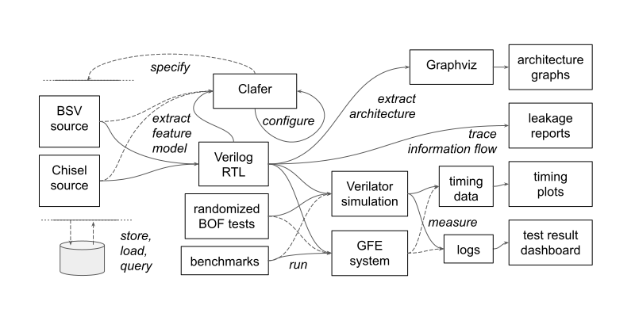

# The BESSPIN Tool Suite

TODO: Release documentation goes here.

### Components:

- https://gitlab-ext.galois.com/ssith/feature-model-configurator-ui
- https://gitlab-ext.galois.com/ssith/arch-extract
- https://gitlab-ext.galois.com/ssith/clafer
- https://gitlab-ext.galois.com/ssith/claferIG
- https://gitlab-ext.galois.com/ssith/riscv-timing-tests
- https://gitlab-ext.galois.com/ssith/halcyon
- https://gitlab-ext.galois.com/ssith/testgen

TODO: submodule tagged release versions
