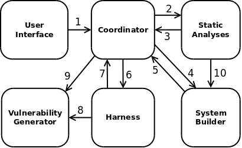

# BESSPIN Tool Suite specifications

This directory will contain textual Lando fragments, diagrams, and other artifacts
that capture the events, scenarios, requirements, architecture, and development plan 
for the Tool Suite project.
Informal [design notes](db-notes.txt) for the evidence database are included here as well.
The domain model can be found
in [the BESSPIN book](https://gitlab-ext.galois.com/ssith/besspin-book/).

This README document is an systems integration overview for the entire Tool Suite.

## Tool suite dynamics

The diagram below is intended to be a compressed message relation
as explained in Chapter 5 of [the BON book](http://www.bon-method.com/book_print_a4.pdf).
It represents the "call graph" or potential communication structure between tool suite subsystems.
All usage scenarios should be representable as paths through this diagram.
Several examples are worked out below.
The arrows indicate *origination* of commands or queries,
with implicit data flow along return paths for synchronous calls.
Asynchronous returns from long-running operations are shown explicitly as separate arrows.

### Subsystem inventory

- [**User Interface**](user-interface.lando.md) is a web front-end, including interactive configurator and dashboard components.
- [**Coordinator**](coordinator.lando.md) includes the web server, database, and Nix cache. It also schedules and monitors analysis jobs.
- **Static Analyses** include all operations on RISC-V processor designs that don't require them to run RISC-V programs.
- [**System Builder**](system-builder.lando.md) turns Lando system specifications and configurable HDL project source into Verilog, FPGA bitstreams, or executable simulations.
- [**Harness**](harness.lando.md) compiles and runs RISC-V programs on target systems made by the System Builder.
- [**Vulnerability Generator**](vulnerability-generator.lando.md) produces executable RISC-V code modeling defined vulnerabilities.

**TODO:** Link to Lando specs for each subsystem.

### Example scenarios

The simplest use cases only involve the web UI and database.

**Scenario: Configure predefined feature model**  
1.*Select model from database; configure interactively; store resulting configuration*

**Scenario: View measurement data**  
1.*Select a model configuration; browse its stored results; download data*

**Scenario: Compare and optimize**  
1.*Select multiple existing configurations; use MOO tools; download report*

Feature model and architecture extraction are specific forms of static analysis on HDL designs.

**Scenario: Extract feature model**  
1.*Upload BSV, Chisel, or System Verilog design files*  
2.*Schedule and run feature model extraction*  
10.*Attempt to build potential design configurations*  
3.*Store extracted feature model when finished*  

Architecture extraction uses the same communication path between the subsystems,
although the resulting data is completely different.

Some lightweight forms of static analysis may run quickly but still require
a relatively slow process of compiling high-level HDL source into Verilog RTL.

**Scenario: Measure complexity of newly configured design**  
1.*Select a configuration; request complexity measure*  
4.*Compile configured design to synthesizable Verilog RTL*  
5.*Cache RTL associated with configuration*  
2.*Run complexity metric on cached RTL; store result*  

Dynamic analyses that operate on a running processor have a similar dependency on System Builder.

**Scenario: Run static ISA tests in an FPGA**  
1.*Select configured design; request ISA test results*  
4.*Compile to Verilog if not cached; build bitstream*  
5.*Store bitstream when finished*  
6.*Set up harness instance on FPGA host; load bitstream; run cached ISA tests*  
7.*Store test results*  

**Scenario: Run generated buffer overflow tests in soft simulation**  
1.*Select configured design; request BOF test results*  
9.*Interactively configure test generator and classifier*  
4.*Build Verilator simulation of design*  
5.*Cache simulation*  
6.*Set up harness around simulation and generator*  
8.*Generate BOF test cases on demand; run; classify*  
7.*Store classified test results*  
