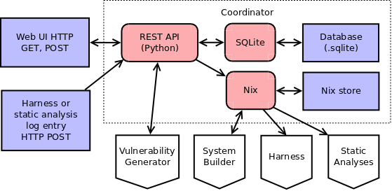

# Coordinator



```
subsystem Coordinator
  indexing
    owner: Max Orhai <max.orhai@galois.com>
    contributors: Benoit Razet <benoit.razet@galois.com>
      Stuart Pernsteiner <spernsteiner@galois.com>

component REST API
  Handles HTTP requests from web UI and remote hosts; implemented in UI repo
  // @todo MaxO add queries and commands for UI routes
  Store this analysis result log entry!
  What vulnerability models are available? 
  How can this vulnerability model be configured?
  Store this vulnerability configuration!

component SQLite
  Stores and retrieves model configurations and analysis results

component Nix
  Configures, stores, and retrieves target systems and tools which build them
  Store this OS image!
  Store this processor design!
  What is a shell with this configured DUT source?
  What is a shell with this executable DUT?
  What is a shell with this executable DUT and this OS image?

subsystem Database UI
  indexing
    owner: Ben Razet <benoit.razet@galois.com>
    contributors:

  // Implemented in database.py of ui repo
  component Schema
    Contains the fields related feature models:
      uid, filename, source, conftree, date, hash, configs, last_update.
  component Public Interface
    List entries?
    List models? // entries formatted for UI
    Get model info by uid?
    Insert feature model!
    Update feature model!


subsystem REST API UI
  indexing
    owner: Ben Razet <benoit.razet@galois.com>
    contributors:

  // Implementation in server_flask.py of ui repo
  component Overview Route
    // Route is "/overview/"
    Delivers the Overview UI.
  component Configurator Route
    // Route is "/configurator/"
    Delivers the Configurator UI.
  compoenent Dashboard Route
    // Route is "/dashboard/"
    Delivers the Dashboard UI.

```
