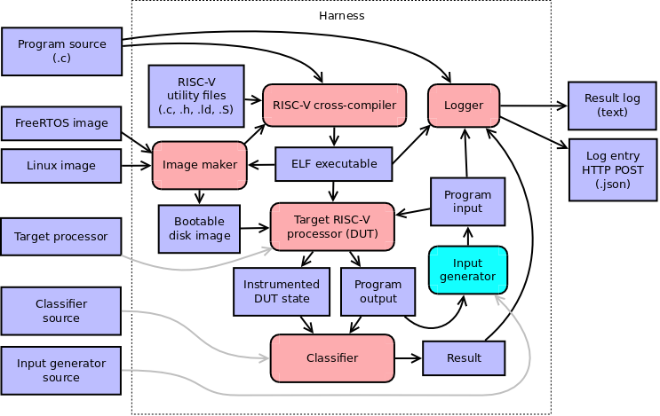

# Harness



```
subsystem Harness
  indexing
    owner: Max Orhai <max.orhai@galois.com>
    contributors:

component Cross-compiler
  What is a RISC-V ELF executable for these source files and these utility files?
  Were there any errors or warnings when compiling that ELF?
  The ELF should run on either Linux, FreeRTOS, or a bare RISC-V processor.
  // ... eventually also FreeBSD
  The ELF should produce UART serial console output.
  The ELF may accept UART serial console input.

component Image maker
  What utility files are needed to compile an executable for this OS base image?
  What is a bootable disk image for this OS base image and this ELF executable?
  The bootable disk image should fit in available FPGA flash.

component DUT
  This is either an FPGA bitstream or a Verilator simulation.
  // ... or perhaps eventually an emulator
  Load this ELF executable!
  Load this bootable disk image!
  Boot!
  Halt!
  Read this console input!
  What is your instrumented state?
  What is your console output?

component Classifier
  What is the result class of this program output and this DUT state measured at this elapsed time?

component Input generator
  What is a DUT program input for this output?
  Generated inputs and outputs must be serialized.

component Logger
  What is a log entry for this program source, this ELF, this program input, and this result class?
  What is the JSON form of that log entry?
  POST that JSON log entry to the configured HTTP endpoint!
```
