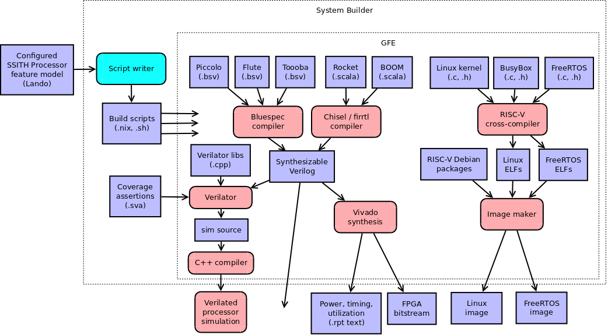

# System Builder



```
subsystem System Builder
  indexing
    owner: Max Orhai <max.orhai@galois.com>
    contributors:

component Script Writer
  What is a processor build script for this configured processor model?
  What is an OS image build script for this configured system model?
  The model configurations must be valid.

component Bluespec Compiler
  What is a Verilog design for this BSV design with these parameters?
  Were there any errors or warnings when compiling that BSV design?

component Chisel Compiler
  What is a Verilog design for this Chisel design with these parameters?
  Were there any errors or warnings when compiling that Chisel design?

component Vivado
  What is a synthesized bitstream for this Verilog design?
  What is the estimated power consumption of that bitstream's CLB logic?
  How many CLB LUTs and registers will that bitstream use?
  What is the frequency of that bitstream's processor core?
  The Verilog design must be synthesizable.
  The Verilog design must include the GFE SoC.
  The Verilog design must use the GFE clock tree.

component Verilator
  What is a simulator for this Verilog design?
  What is a coverage-instrumented simulator for this Verilog design and these SVA cover points?
  Were there any errors or warnings when compiling that Verilog design?
  The Verilog design must be synthesizable.

component Image maker
  What is a bootable Linux image for this build script?
  What is a bootable FreeRTOS image for this build script?
```
