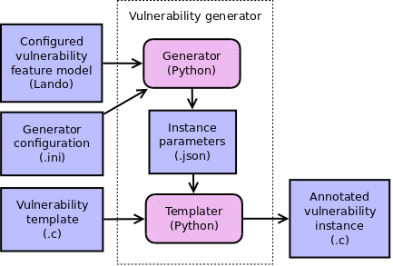

# Vulnerability Generator



```
subsystem Vulnerability Generator
  indexing
    owner: Max Orhai <max.orhai@galois.com>
    contributors:

component Generator
  Use this generator configuration!
  What is an instance of this vulnerability model?
  The vulnerability model configuration must be valid.
  The vulnerability model configuration may be partial.

component Templater
  What is a vulnerability instance with these parameters in this template?
  // A non-local constraint... Can I promote it to subsystem level?
  The vulnerability template must be compatible with Generator's vulnerability model.
```
